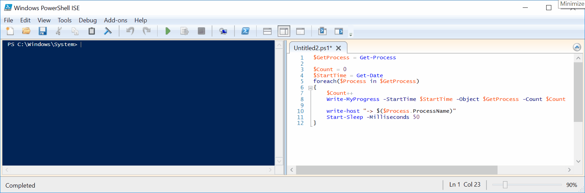

# Write-MyProgress



## SYNOPSIS  
Displays a progress bar within a Windows PowerShell command window.

## DESCRIPTION
The Write-Progress cmdlet displays a progress bar in a Windows PowerShell command window that depicts the status of a running command or script.
    
## NOTES  
  - **File Name**   : Write-MyProgress.ps1
  - **Author**      : Thomas ILLIET, contact@thomas-illiet.fr
  - **Date**        : 2017-05-10
  - **Last Update** : 2018-01-08
  - **Version**     : 1.0.1

## INSTALL
```
Install-Script -Name Write-MyProgress
``` 

## EXAMPLE
```  
$GetProcess = Get-Process

$Count = 0
$StartTime = Get-Date
foreach($Process in $GetProcess)
{
    $Count++
    Write-MyProgress -StartTime $StartTime -Object $GetProcess -Count $Count

    write-host "-> $($Process.ProcessName)"
    Start-Sleep -Seconds 1
}
```  